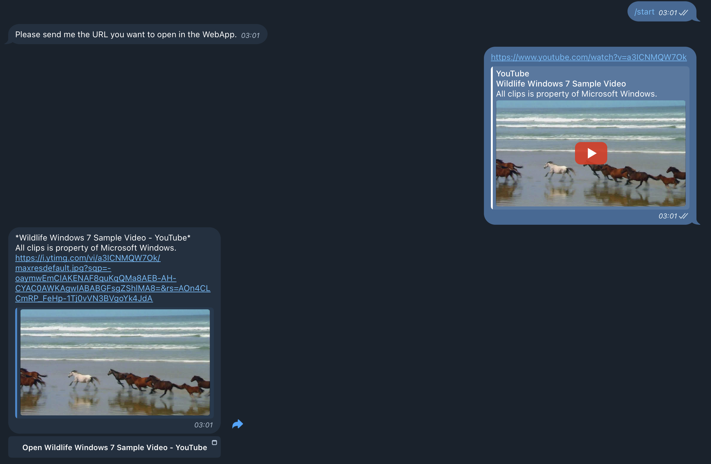

# TelegramiFrame 🤖🌐

TelegramiFrame is a Telegram bot that allows users to stream websites within a Telegram Mini App. Users can send a URL to the bot, which then provides an inline button to open the website in a WebApp.

## Features ✨

- Streams websites within a Telegram Mini App
- Provides an inline button to open the URL in a WebApp
- Displays a preview with the website's title, description, and preview image

## Installation 🛠️

1. Clone the repository:
    ```sh
    git clone https://github.com/yourusername/TelegramiFrame.git
    cd TelegramiFrame
    ```

2. Create a virtual environment and activate it:
    ```sh
    python3 -m venv venv
    source venv/bin/activate
    ```

3. Install the required dependencies:
    ```sh
    pip install -r requirements.txt
    ```

4. Create a [.env](http://_vscodecontentref_/0) file in the project directory and add your Telegram bot token:
    ```env
    TELEGRAM_BOT_TOKEN=your-telegram-bot-token
    ```

## Usage 🚀

1. Run the bot:
    ```sh
    python main.py
    ```

2. Start a chat with your bot on Telegram and send a URL. The bot will provide an inline button to open the website in a WebApp.

## Example 📸

## Example 📸



## Contributing 🤝

Contributions are welcome! Please open an issue or submit a pull request.

## License 📄

This project is licensed under the MIT License. See the LICENSE file for details.

## Acknowledgements 🙏

- [python-telegram-bot](https://github.com/python-telegram-bot/python-telegram-bot)
- [BeautifulSoup](https://www.crummy.com/software/BeautifulSoup/)
- [requests](https://docs.python-requests.org/en/latest/)

---

Made with ❤️ by [Your Name](https://github.com/yourusername)